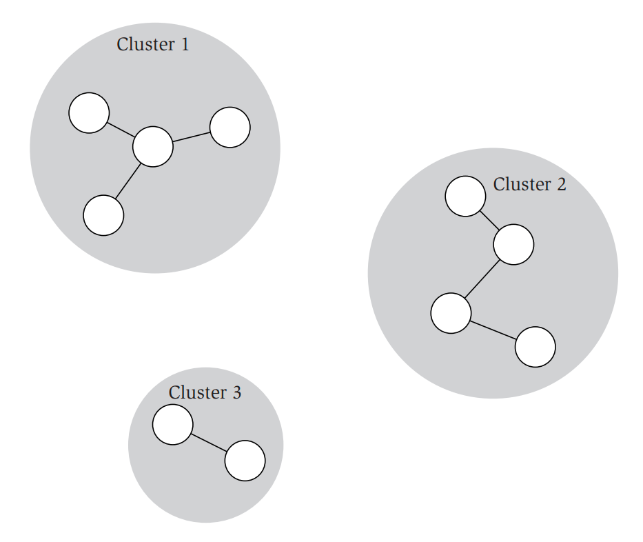

**This solution is finished.**

You are the owner of a new store chain (called Amazing Donuts, or AD for short), and business is running well, so you decide to open up some more stores. You decide to do this in the town of Scatterville, where the houses of all residents are literally scattered around the village.

Of course, you want to reach as many people with your donuts as possible. Since you want to place 𝑘
new stores in Scatterville, you decide to divide the houses in 𝑘
“clusters”, and each cluster will get its own store. Every house will belong to exactly one store cluster.

Given the coordinates of the houses in Scatterville, and how many stores you will open, can you calculate where the new stores should be placed?
# Example
Consider the following example. Here, three stores will be opened in Scatterville. The first and second clusters contain four houses each, while the third cluster only contains two houses. The stores will be placed at the average x and y coordinate of these clusters.
!(IdeaProjects/AD2324/planning-store-locations/img.png)
